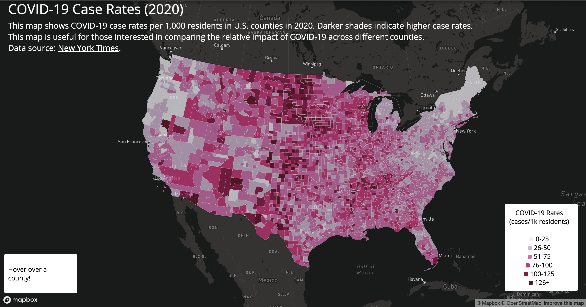
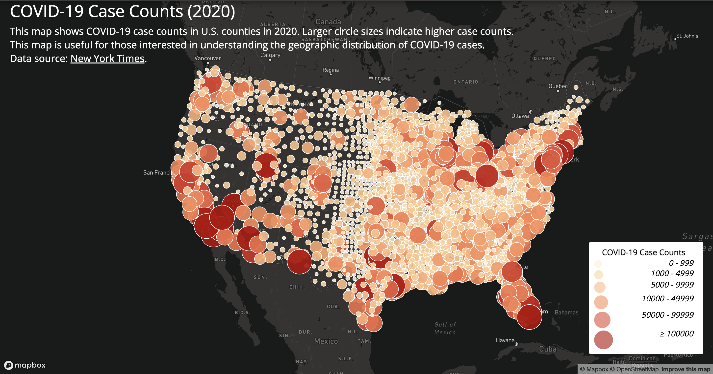

# COVID-19 Interactive Map

## Introduction
This project visualizes the geographic distribution of Covid-19 cases across U.S. counties in 2020. It includes two interactive maps: one displaying the case rate and another the case count. Map 1 is a choropleth map that allows users to view the case rate of Covid-19. The rate is calculated as cases per 1,000 residents. Map 2 is a proportional symbol map that allows users to view the number of Covid-19 cases in a county. These maps allow users to visualize the spread of Covid-19 through different variables, which provide multiple contexts for interpretation.

## Map Information & Functions
### Covid-19 Case Rates

[Map Link](https://margaretjou.github.io/web-map-application/map1.html)
- This map displays the Covid-19 case rate in each U.S. county.
- Users can hoover over a county to see the case rate for that county. 

### Covid-19 Case Counts

[Map Link](https://margaretjou.github.io/web-map-application/map2.html)
- This map displays the total amount of Covid-19 cases in each U.S. county.
- Users can click on a circle to see the case count for that county. 

## Libraries
This project uses the Google Fonts library to customize font and the Mapbox GL JS library to create the interactive maps.

## Data Sources
- Covid-19 Case Counts: [New York Times](https://github.com/nytimes/covid-19-data/blob/43d32dde2f87bd4dafbb7d23f5d9e878124018b8/live/us-counties.csv)
- Covid-19 Case Rates: [U.S. Census Bureau](https://data.census.gov/table/ACSDP5Y2018.DP05?g=0100000US$050000&d=ACS+5-Year+Estimates+Data+Profiles&hidePreview=true)
- U.S. County Boundaries Shapefile: [U.S. Census Bureau](https://www.census.gov/geographies/mapping-files/time-series/geo/carto-boundary-file.html)

## Credits
- Professor Zhao for the lab instructions which provided the guidance on how to build this project.
- Mapbox GL JS and Google Fonts for providng the libraries.
- U.S. Census Bureau and New York Times for providing the data sources.

## Acknowledgements
Thank you to Professor Zhao for the class lectures and materials that provided me the foundational knowledge and information I needed to build these maps. 
 
## AI Disclosure 
I used AI in this assignment for debugging and suggesting minimal fixes that I personally edited and customized. I did not use AI to write or complete any components where AI use is prohibited. If AI was used for debugging or development, I am able to explain the relevant code and decisions.

